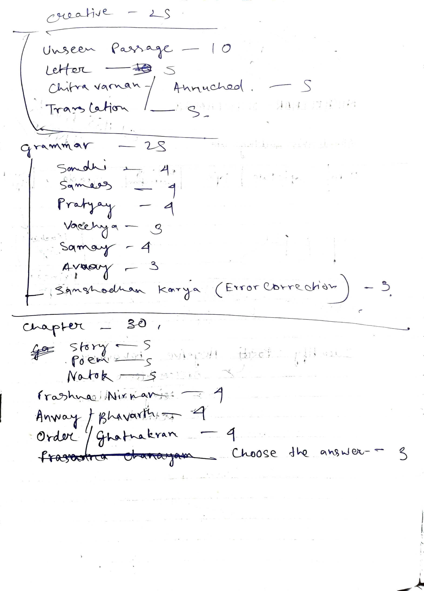

# Syllabus

# Sample Papers
Sanskrit for Class 10 Term 2 (examguru).pdf
## Year-starting
Sanskrit-SQP-4.pdf > Sanskrit-MS-1.pdf

# Marking Pattern

# Possibilities 
## Ghatnakram Anusar 
- Buddhirbalvati
# Holiday Homework
## Summer
HOLIDAY HOMEWORK 2023-24 संस्कृत .pdf
[[Sanskrit Annuched]]

---

# Backlinks

[[Sanskrit MOC|Sanskrit]]

---
%%
Dates: April 1, 2023
%%