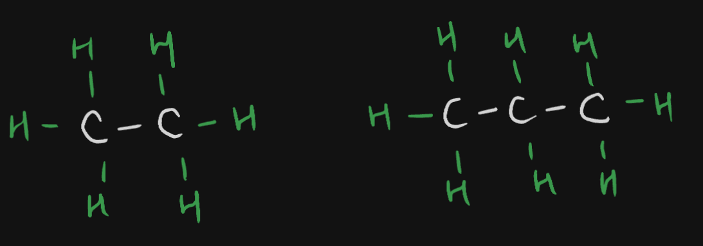

---
aliases:
  - Alkanes
tags:
  - Study
  - 10th/Science/Chem/Ch4-Carbon-and-Compounds
date: November 20, 2023
---
# Definition
The **Alkane** group contains saturated hydrocarbons.
- They have single covalent bonds all throughout.
- Example:
	- Ethane ($\ce{C2H6}$), Propane ($\ce{C3H8}$), etc.
	  

---
# Backlinks
[[Hydrocarbons]]

---
# Flashcards

The {{**Alkane**}} group contains {{saturated}} hydrocarbons.
<!--SR:!2024-06-02,121,284!2024-04-27,96,282-->

---

%%
Dates: November 20, 2023
%%