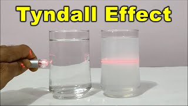

# Definition
The directionless spreading of light is called the scattering of light.
## Tyndall Effect
It is the phenomenon through which the path of light gets visible in the colloidal particles.

## Colour of Scattered Light
The colour of the light depends on the size of the particle. The fine particles scatter the blue light and the bigger particles scatter different colours. The size of the particle should be compatible with the wavelength of the colour. The smaller the particle, the more it would scatter light.
### Why sky looks blue?
Because the atmosphere contains fine particles with scatter blue light more strongly than the red light.
The sky appears dark in higher altitudes because there is no scattering involved.
## Sun and its colour at different times
When it is at sunrise or sunset, most of the light, except red light gets scattered away, and thus it appears red (because distance is large, and red light has larger wavelength).
But when it is at the top, the distance is less, and light is not much scattered, and it remains as white light.

---
# Backlinks
[[The Human Eye and The Colorful World|Phy Ch10]]

---
# Flashcards

What is the Tyndall Effect?
?
It is the phenomenon through which the path of light gets visible in the colloidal particles.
<!--SR:!2024-04-08,164,282-->

The colour of the light depends on the {{size}} of the particle.
<!--SR:!2025-08-03,534,280-->

Why sky looks blue?
?
Because the atmosphere contains fine particles with scatter blue light more strongly than the red light.
The sky appears dark in higher altitudes because there is no scattering involved.
<!--SR:!2024-10-09,270,242-->

The {{smaller}} the particle, the more it would scatter light.
<!--SR:!2025-01-13,367,262-->

---

%%
Dates: August 3, 2023
%%