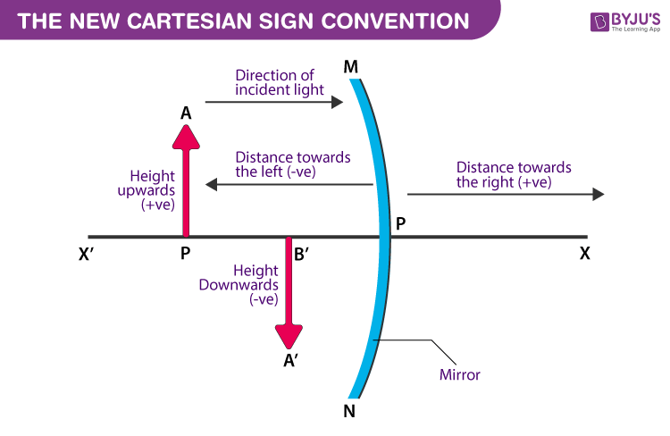

---
Alias:
tags: Study, 10th/Science/Physics/Ch9-Light
date: July 6, 2023
---
# Definition
The *New Cartesian Sign Convention* is used as the sign convention for the mirrors or lenses. 
- The Pole is taken as the origin
- The Principal Axis is taken as the X-Axis.

## Rules
**Everything is based on the incident ray, and incident ray is always positive.** If ray is coming from left to right:
- The object is always placed at the left of the mirror.
- All distances parallel to the principal axis is measured from the pole of the mirror.
- Distances to the **right of the mirror is always taken as positive** and **left of the mirror is taken as negative**
- Distance perpendicular to and above the principal axis is taken as positive
- Distance perpendicular to and below the principal axis is taken as negative

---
# Backlinks
[[Spherical Lenses]]
[[Spherical Mirrors]]

---
# Flashcards

---

%%
Dates: July 6, 2023
%%