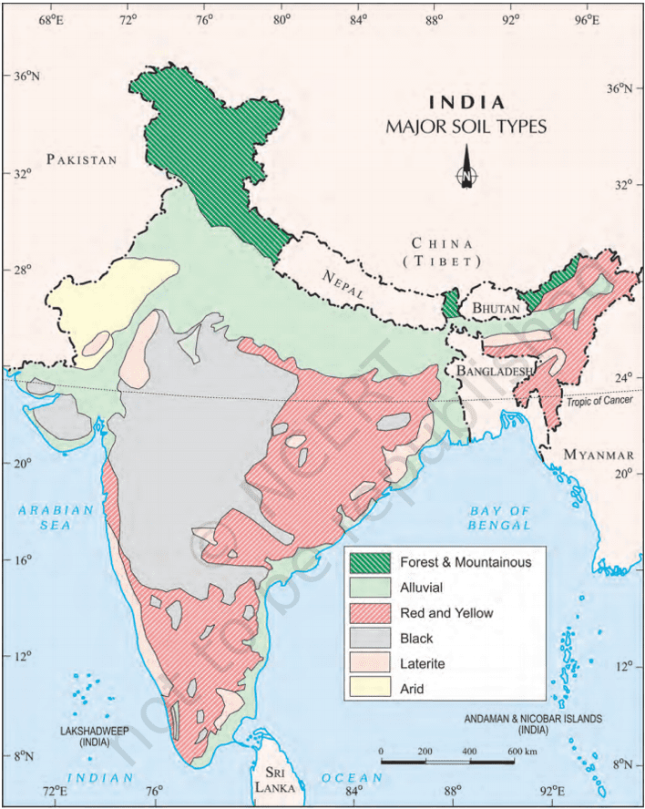

# Definition
## Alluvial Soil
- Formed by deposits brought by rivers
- **Northern Plains, Chathisgahar plains and Coastal Plains**
- Suitable for all kinds of crops
- Vary in nature from sandy loam to clay
- Generally rich in Potash but poor in Phosphorous
  Rice, Wheat, Sugarcane, Tobacco, Jute, Fruits and Vegetables
1.  **Old alluvial or Bhangar**
	- The Bhangar soil is found in the higher reaches about 30 m above the flood level. 
	- These are coarse in texture.
	- The Bhangar soils are less fertile.
2. **New Alluvial or Khadar**
	- The Khadar soil is found in low areas of valley bottom which are flooded every year. 
	- These soil are fine in texture.
	- The Khadar soils are more fertile.
## Black Soil
- These soils have been formed due to the weathering of the lava spread over large areas during volcanic activity in the Deccan Plateau and different climatic conditions
- **Found in the plateaus of MH, MP, Malwa P and Chhattisgarh also along the Godavari and the Krishna valleys**
- Made up of extremely fine, i.e., clayey material. 
- Well-known for their capacity to hold moisture. Rich in calcium carbonate, magnesium, potash and lime
- Well suited for cotton
## Red and Yellow Soil
- Red and yellow soil is formed due to weathering of Crystalline igneous rocks (intrusive igneous rock) in the presence of low rainfall and high temperature climatic condition.
- **Found in the areas of low rainfall in the Deccan plateau. Also found in parts of Odisha, Chhattisgarh, southern parts of the middle Ganga plain and along the piedmont zone of the Western Ghats.**
- Develop a reddish colour due to diffusion of iron in crystalline and metamorphic rocks
- This soil is mainly suitable for dry farming growing cotton , wheat, pulses, tobacco, jowar, linseed, millet, potato and fruits with better irrigation.
## Laterite Soil
- The laterite soil develops under tropical and subtropical climate with the alternate wet and dry season.
- This soil is the result of intense leaching due to heavy rain. Lateritic soils are acidic (pH<6.0) in nature and generally deficient in plant nutrient
- **It is found mostly in Western Ghats region of Maharashtra, Odisha, some parts of West Bengal and North-East regions.**
- Acidic in character, the soils are coarser and crumblier in texture. 
- Laterite soils are infertile and unsuitable for cultivation due to a lack of nitrogen, potassium, and organic components.
- Laterite soils are generally suitable for most of the dryland crops. It is mainly cultivated with coconut, arecanut, banana, tapioca, vegetables, yams, pepper, pineapple, fruit trees etc.
## Arid Soil
- Arid soils are formed from the fragmentation of adjacent rocks and are largely blown from Indus valley area and coastal regions. 
- It mainly ranges from red to brown in colour. It is generally sandy to gravelly in texture, and have a high percentage of soluble salts.
- **Found in the western parts of Rajasthan.**
- After proper irrigation these soils become cultivable.
- The soil red and brown in colour. It is sandy and saline in nature and lacks humus and moisture. Arid soils contain a substantial amount of soluble salts. 
- It is alkaline in nature because there is no rain to wash soluble salts
- These soils are very infertile, but with proper fertilizers and irrigation, the drought resistant and salt tolerant dry crops such as barley, cotton, wheat, millets, maize, pulses, etc., can be grown.
## Forest Soil
- Forest soils are formed in mineral deposits, are generally freely draining, and occur in several major soil groups. 
- Peat soils are formed in situ from the dead and decomposing remains of mire growing plants, they may or may not support trees, and belong to the major soil group of histosols.
- **Found in the hilly and mountainous areas where sufficient rain forests are available**
- The soils comprises of high amount of humus, but are deficient in potash, phosphorus and lime.
- Suitable Crops of Forest and Mountain Soils – These soils are good for cultivating tea, spices, wheat, maize, barley, coffee and tropical fruits, and temperate fruits.

## Map

---
# Backlinks
[[Land in India]]

---
# Flashcards

---

%%
Dates: December 8, 2023
%%