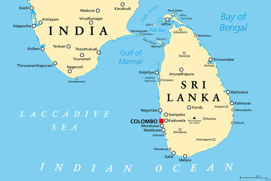

---
Alias:
tags: Study, 10th/SST/Geo/Ch1-Resources-and-Development
date: April 5, 2023
cards-deck:
---

# Overview
Sri Lanka is an island nation just a few kilometres south of the coast of Tamil Nadu. It has a population of about 2 crores. It gained independence in 1948 and a series of Majoritarian events followed. ^d0201c

## Map:

# [[Ethnic Composition of Sri Lanka]]

---
# Backlinks

[[Power-Sharing|Civics Ch1]]
[[Geography MOC|Geo]]

---
%%
Dates: April 5, 2023
%%