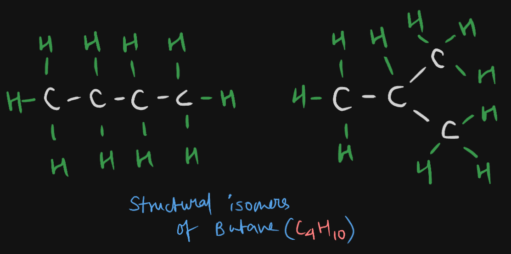

# Definition
Same compound, same formula, same no. of atoms, but arranged differently.
For example, butane ($\ce{C4H10}$):

Here, one is a **chain** and one is a **branch**.
## Alkyl Group and Nomenclature
### Alkyls in General

### Naming Compounds with Alkyls

---
# Backlinks
[[Catenation]]

---
# Flashcards

What are alkyls?
?
These are the molecules whose branches come out of the main branch.

<!--SR:!2024-03-29,67,260-->

---

%%
Dates: November 18, 2023
%%