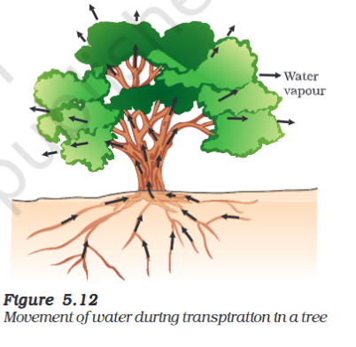

---
Alias:
tags: Study, 10th/Science/Bio/Ch5-Life-Processes
date: June 22, 2023
---
# Definition
Due to the large distance between the soil and different parts of the plant, a transportation system is needed.
Generally plants do not move, and they have many dead cells, that is why they possess low energy needs than others, and thus the transportation system is far more slower.
This is done by the **Vascular System:** Xylem and Phloem
## Transport of Water
Transportation of water from the soil to the parts of the plant is done by the **xylem.** It is one way (bottom to top)

### The Process
The cells at the roots in contact with the soil take up ions actively, this creates a difference in pressure of ions in the soil. This is how water moves into the root to compensate the difference.
### Factors helping the transport
As the height of the plant increases, diffusion pressure is simply not enough. That is how **transpiration** plays a role in creating a difference of concentration of water so that water can move into the parts.
## Transport of food
This is done by the **Phloem** and is also known as **Translocation.** This is done both ways.
### The process
Unlike Xylem, it uses **energy** to transport material synthesised by Photosynthesis. Material like sucrose is transferred to the Phloem by utilising ATP, this increases osmotic pressure which forces the water to move into it. This leads to the material moving from high to low conc. according to the needs of the plant.
## Parts of Xylem and Phloem
### Xylem
- Tracheid - dead
- Vessels - dead
- Xylem Parenchyma - alive
- Xylem Fibres - dead
Most of the parts are dead to provide mechanical support
### Phloem
- Sieve Tubes and Plate - alive
- Companion Cells - alive
- Phloem Parenchyma - alive
- Phloem Fibres. - dead

---
# Backlinks
[[Transportation]]

---
# Flashcards

Why is there a need for transportation system in plants?;;Due to the large distance between the soil and different parts of the plant, a transportation system is needed.
<!--SR:!2024-03-30,157,247-->

Why does plants have low energy needs?;;Generally plants do not move, and they have many dead cells, that is why they possess low energy needs than others, and thus the transportation system is far more slower.
<!--SR:!2024-05-06,223,266-->

What is the Vascular System?;;Transportation system of plants containing Xylem and Phloem Tissues.
<!--SR:!2024-05-12,238,290-->

How is water transported in the plant?
?
This is done by the xylem.
The cells at the roots in contact with the soil take up ions actively, this creates a difference in pressure of ions in the soil. This is how water moves into the root to compensate the difference.
<!--SR:!2024-05-12,133,246-->

What is the role of Transpiration in moving of water?;;Sometimes, due to the height of the plant, the diffusion pressure is simply not enough, that is where **transpiration** plays a role in creating a difference of conc. of water so that water may move upward.
<!--SR:!2025-01-07,400,280-->

How is food transportation to various parts of a plant?
?
This is done by Phloem and the process is known as translocation.
Unlike Xylem, it uses **energy** to transport material synthesised by Photosynthesis. Material like sucrose is transferred to the Phloem by utilising ATP, this increases osmotic pressure which forces the water to move into it. This leads to the material moving from high to low conc. according to the needs of the plant.
<!--SR:!2024-04-09,142,227-->

What is translocation?;;Transport of food to various parts of a plant by Phloem.
<!--SR:!2024-05-22,245,286-->

What are the parts of xylem?
?
- Tracheid - dead
- Vessels - dead
- Xylem Parenchyma - alive
- Xylem Fibres - dead
<!--SR:!2025-08-14,580,300-->

Why are most of the parts are dead in xylem?;;Most of the parts are dead to provide mechanical support
<!--SR:!2024-06-26,168,260-->

What are the parts of phloem?
?
- Sieve Tubes and Plate - alive
- Companion Cells - alive
- Phloem Parenchyma - alive
- Phloem Fibres. - dead
<!--SR:!2025-08-09,576,300-->

---

%%
Dates: June 22, 2023
%%