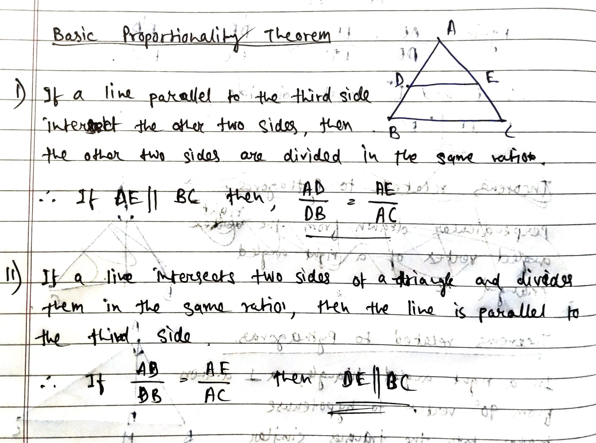
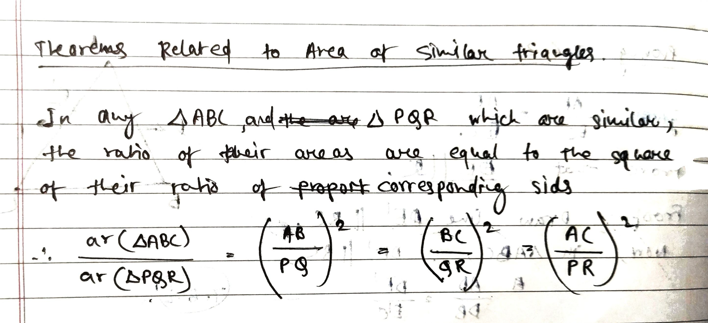
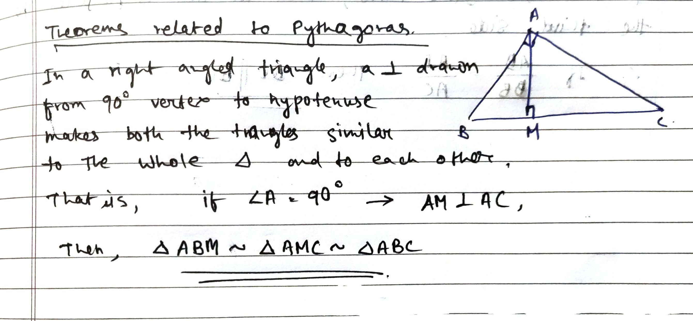

---
Alias:
tags: Study, 10th/Maths/Ch6-Triangles
date: August 16, 2023
---
# Theorems
## Basic Proportionality Theorem

## Areas of Similar Triangles

## Related to Pythagoras

## Angle Bisector Theorem

# Similarity Criterias
- AAA
- AA
- SSS
- SAS

---
# Backlinks
Maths

---
# Flashcards

---

%%
Dates: August 16, 2023
%%