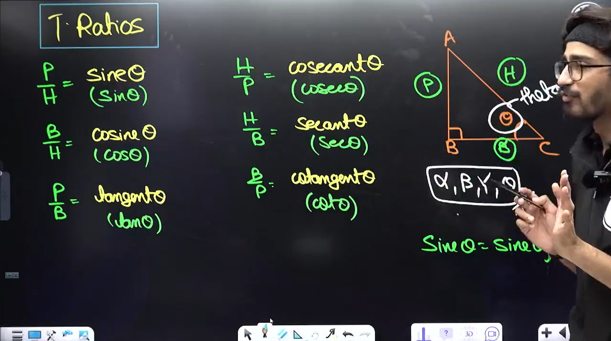
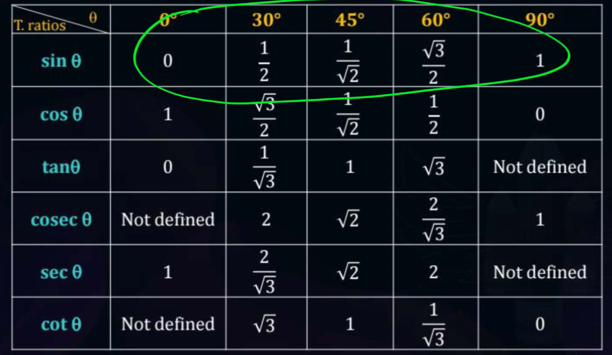

---
Alias:
tags: Study, 10th/Maths/Ch8-Trigonometry
date: August 8, 2023
---
# Definition
## Trignometric Ratios
These are the ratios between the sides of a right-angled triangle

## Ratios of Specific Angles

## Holy shit
Mathematics, page 225 Pearsons babu

---
# Backlinks
[[Trigonometry]]

---
# Flashcards
## Ratios

sinθ = {{$\frac{P}{H}$}}
<!--SR:!2024-06-19,219,260-->

cosθ = {{$\frac{B}{H}$}}
<!--SR:!2024-05-18,151,243-->

tanθ = {{$\frac{P}{B}$}}
<!--SR:!2024-08-12,239,258-->

cosecθ = {{$\frac{H}{P}$}}
<!--SR:!2024-12-23,363,283-->

secθ = {{$\frac{H}{B}$}}
<!--SR:!2025-02-19,368,263-->

cotθ = {{$\frac{B}{P}$}}
<!--SR:!2024-03-08,72,203-->

## Relations

{{$\frac{sin\theta}{cos\theta}$}} = {{$tan \theta$}}
<!--SR:!2024-09-10,262,263!2025-01-16,387,290-->

{{$\frac{cos\theta}{sin\theta}$}} = {{$cot\theta$}}
<!--SR:!2024-09-11,259,263!2024-12-05,352,283-->

{{$\frac{tan\theta}{sec\theta}$}} = {{$sin\theta$}}
<!--SR:!2024-08-17,184,245!2024-09-27,225,285-->

## Specific Angles

Sin0° = {{0}}
<!--SR:!2024-05-03,170,258-->

Sin30° = {{$\frac{1}{2}$}}
<!--SR:!2024-07-18,249,283-->

Sin45° = {{$\frac{1}{\sqrt2}$}}
<!--SR:!2024-07-07,238,278-->

Sin60° = {{$\frac{\sqrt3}{2}$}}
<!--SR:!2024-12-13,356,283-->

Sin90° = {{1}}
<!--SR:!2024-08-25,252,240-->

---

%%
Dates: August 8, 2023, August 12, 2023
%%