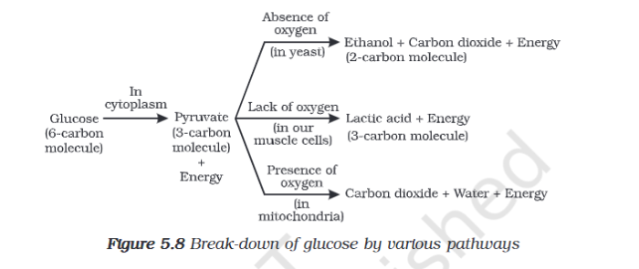

---
Alias:
tags: Study, 10th/Science/Bio/Ch5-Life-Processes
date: June 6, 2023
---
# Definition
There are two types of respiration:
## Aerobic Respiration
## Anaerobic Respiration
Also a sub-type, which is produced due to lack of oxygen.

---
# Backlinks
Respiration

---
# Flashcards

---

%%
Dates: June 6, 2023
%%