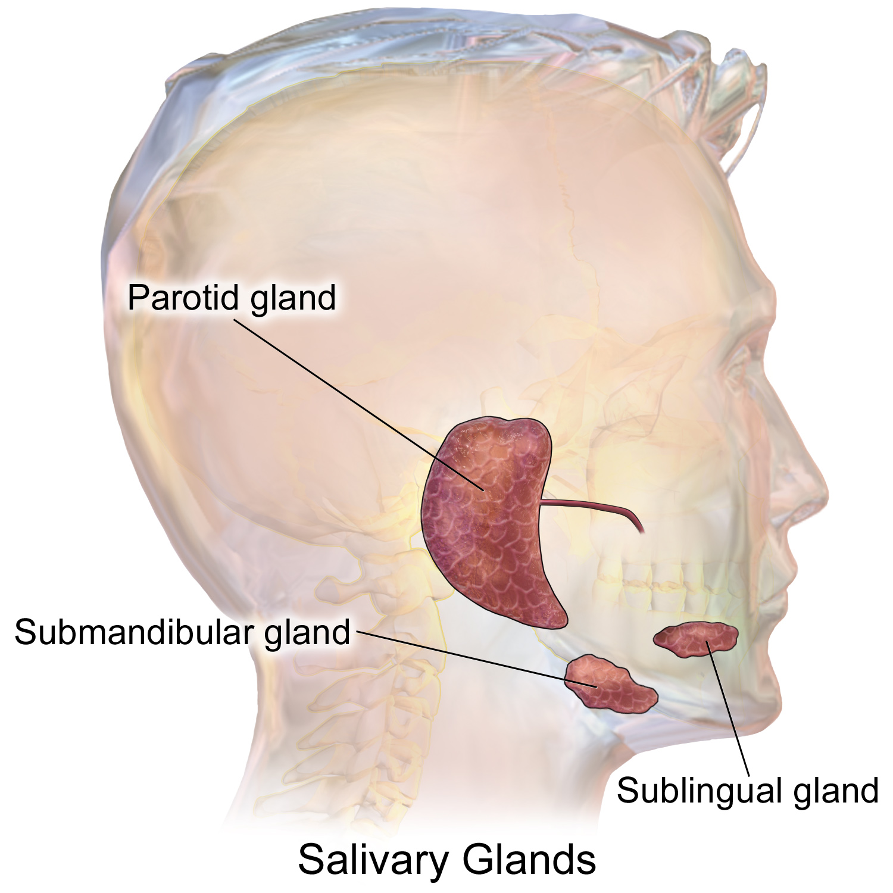

---
Alias:
tags: Study, 10th/Science/Bio/Ch5-Life-Processes
date: April 30, 2023
---
# Definition
## Parotid
It is situated the roof of the buccal cavity
## Sublingular
It is situated below the tongue
## Submaxillary / Submandibular
It is situated near the jaw.

---
# Backlinks
Salivary Gland

---
# Flashcards

---

%%
Dates: April 30, 2023
%%