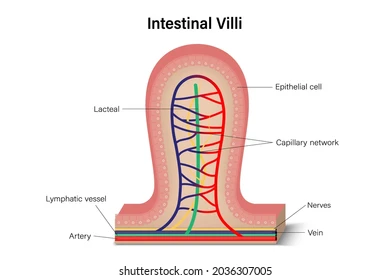

---
Alias:
tags: Study, 10th/Science/Bio/Ch5-Life-Processes
date: June 22, 2023
---
# Definition
They are the small finger like projections present in the small intestine. These help move the food and absorb them.
These contain **blood capillaries** which absorb water soluble nutrients and **lymph capillaries** which absorb fat soluble nutrients 

---
# Backlinks
Small Intestine

---
# Flashcards
What is villi?;;They are the small finger like projections present in the small intestine. These help move the food and absorb them. These contain **blood capillaries** which absorb water soluble nutrients and **lymph capillaries** which absorb fat soluble nutrients
<!--SR:!2025-01-06,377,280-->

Blood capillaries absorb {{water soluble nutrients}} in villi.
<!--SR:!2025-02-19,447,302-->

Lymph capillaries absorb {{fat soluble nutrients}} in villi.
<!--SR:!2025-05-14,439,265-->

---

%%
Dates: June 22, 2023
%%