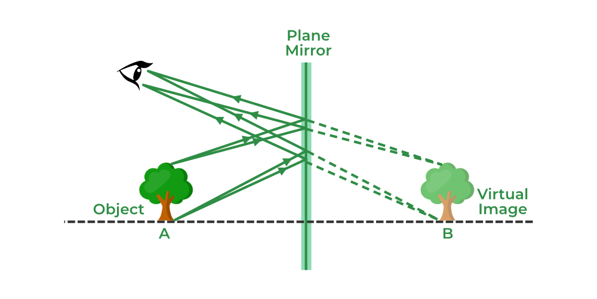

---
Alias:
tags: Study, 10th/Science/Physics/Ch9-Light
date: July 5, 2023
---
# Definition
Virtual image is always formed in an imaginary point on the opposite side of the focus.

---
# Backlinks
Reflection
Properties of Plane Mirror

---
# Flashcards

What is a virtual image?;;Image which is formed at an imaginary point.
<!--SR:!2024-09-21,208,240-->

---

%%
Dates: July 5, 2023
%%