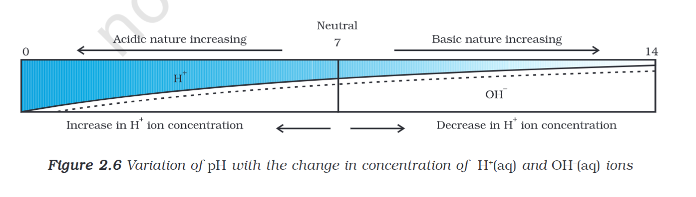

---
Alias:
tags: Study, 10th/Science/Chem/Ch2-Acids-Bases-Salts
date: August 12, 2023
---
# Definition
## pH Scale
A pH scales define the concentration of $\ce{H+}$ ions in a substance. It has a range of 0 - 14

## Importance of pH in daily life
pH plays an important role in carrying out many things in the biological world.
- pH in a living body
	- Blood - 7.4; Urine - 6.5
- pH in digestion
	- Gastric Juices need a acidic environment whereas Pancreatic Juices need an alkaline env.
- pH for Tooth Decay.
	- Tooth Decay occurs in pH <5.5
- pH levels in soil.
	- The soil requires a neutral env.
	- Quick Lime (CaO) is added to make the soil basic
	- Manure is added to make the soil acidic.
- pH in chemical warfare in plants and animals
	- Insect stings contain base or acids
## [[Indicators]]

---
# Backlinks
[[Acids, Bases and Salts|Chem Ch2]]

---
# Flashcards

What is the pH scale?
?
A pH scales define the concentration of $\ce{H+}$ ions in a substance. It has a range of 0 - 14
<!--SR:!2024-05-30,199,280-->

What are the importance of pH in daily life?
?
pH plays an important role in carrying out many things in the biological world.
- pH in a living body
	- Blood - 7.4; Urine - 6.5
- pH in digestion
	- Gastric Juices need a acidic environment whereas Pancreatic Juices need an alkaline env.
- pH for Tooth Decay.
	- Tooth Decay occurs in pH <5.5
- pH levels in soil.
	- The soil requires a neutral env.
	- Quick Lime (CaO) is added to make the soil basic
	- Manure is added to make the soil acidic.
- pH in chemical warfare in plants and animals
	- Insect stings contain base or acids
<!--SR:!2024-06-19,171,220-->

---

%%
Dates: August 12, 2023
%%